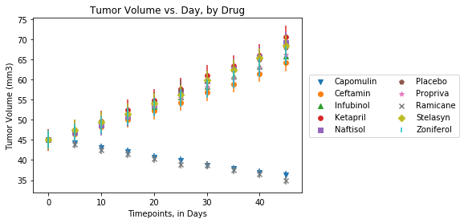

```python
import pandas as pd
import matplotlib.pyplot as plt
import numpy as np
```


```python
#Observed Trend 1: In tracking volume of tumors over time, it is clear that Ramicane and Capomulin
#far outperformed the other drugs in the test.

#Observed Trend 2: In tracking metastatic sites over time, we see that the mouses that were given Ketapril 
#had more metastatic sites than even the group given a placebo.

#Observed Trend 3: The mice given the drug Propriva had the lowest survival rate out of all the mice.
```


```python
#import trial data table
trial_data = pd.read_csv('clinicaltrial_data.csv')
trial_data.head(1)
```


<div>
<style scoped>
    .dataframe tbody tr th:only-of-type {
        vertical-align: middle;
    }

    .dataframe tbody tr th {
        vertical-align: top;
    }

    .dataframe thead th {
        text-align: right;
    }
</style>
<table border="1" class="dataframe">
  <thead>
    <tr style="text-align: right;">
      <th></th>
      <th>Mouse ID</th>
      <th>Timepoint</th>
      <th>Tumor Volume (mm3)</th>
      <th>Metastatic Sites</th>
    </tr>
  </thead>
  <tbody>
    <tr>
      <th>0</th>
      <td>b128</td>
      <td>0</td>
      <td>45.0</td>
      <td>0</td>
    </tr>
  </tbody>
</table>
</div>


```python
#import mouse drug data table
mouse_drug_data = pd.read_csv('mouse_drug_data.csv')
mouse_drug_data.head(1)
```


<div>
<style scoped>
    .dataframe tbody tr th:only-of-type {
        vertical-align: middle;
    }

    .dataframe tbody tr th {
        vertical-align: top;
    }

    .dataframe thead th {
        text-align: right;
    }
</style>
<table border="1" class="dataframe">
  <thead>
    <tr style="text-align: right;">
      <th></th>
      <th>Mouse ID</th>
      <th>Drug</th>
    </tr>
  </thead>
  <tbody>
    <tr>
      <th>0</th>
      <td>f234</td>
      <td>Stelasyn</td>
    </tr>
  </tbody>
</table>
</div>


```python
#combine data tables into one data frame
merged_data = pd.DataFrame.merge(trial_data, mouse_drug_data,on='Mouse ID', how='outer')
merged_data.head(1)
```


<div>
<style scoped>
    .dataframe tbody tr th:only-of-type {
        vertical-align: middle;
    }

    .dataframe tbody tr th {
        vertical-align: top;
    }

    .dataframe thead th {
        text-align: right;
    }
</style>
<table border="1" class="dataframe">
  <thead>
    <tr style="text-align: right;">
      <th></th>
      <th>Mouse ID</th>
      <th>Timepoint</th>
      <th>Tumor Volume (mm3)</th>
      <th>Metastatic Sites</th>
      <th>Drug</th>
    </tr>
  </thead>
  <tbody>
    <tr>
      <th>0</th>
      <td>b128</td>
      <td>0</td>
      <td>45.0</td>
      <td>0</td>
      <td>Capomulin</td>
    </tr>
  </tbody>
</table>
</div>


```python
#print the list of all drugs named in the trial
drugs = merged_data['Drug'].drop_duplicates(keep='first')
drugs.sort_values()
```


    0       Capomulin
    1317     Ceftamin
    213     Infubinol
    10       Ketapril
    63       Naftisol
    1113      Placebo
    861      Propriva
    436      Ramicane
    428      Stelasyn
    921     Zoniferol
    Name: Drug, dtype: object


```python
#list of the timepoints
timepoints=[0,5,10,15,20,25,30,35,40,45]
```


```python
pd.set_option('display.max_rows',500)
```


```python
printed_volume = merged_data.groupby(['Drug', 'Timepoint'])
printed_volume = printed_volume['Tumor Volume (mm3)'].mean()
printed_volume = pd.DataFrame(printed_volume)
printed_volume
```


<div>
<style scoped>
    .dataframe tbody tr th:only-of-type {
        vertical-align: middle;
    }

    .dataframe tbody tr th {
        vertical-align: top;
    }

    .dataframe thead th {
        text-align: right;
    }
</style>
<table border="1" class="dataframe">
  <thead>
    <tr style="text-align: right;">
      <th></th>
      <th></th>
      <th>Tumor Volume (mm3)</th>
    </tr>
    <tr>
      <th>Drug</th>
      <th>Timepoint</th>
      <th></th>
    </tr>
  </thead>
  <tbody>
    <tr>
      <th rowspan="10" valign="top">Capomulin</th>
      <th>0</th>
      <td>45.000000</td>
    </tr>
    <tr>
      <th>5</th>
      <td>44.266086</td>
    </tr>
    <tr>
      <th>10</th>
      <td>43.084291</td>
    </tr>
    <tr>
      <th>15</th>
      <td>42.064317</td>
    </tr>
    <tr>
      <th>20</th>
      <td>40.716325</td>
    </tr>
    <tr>
      <th>25</th>
      <td>39.939528</td>
    </tr>
    <tr>
      <th>30</th>
      <td>38.769339</td>
    </tr>
    <tr>
      <th>35</th>
      <td>37.816839</td>
    </tr>
    <tr>
      <th>40</th>
      <td>36.958001</td>
    </tr>
    <tr>
      <th>45</th>
      <td>36.236114</td>
    </tr>
    <tr>
      <th rowspan="10" valign="top">Ceftamin</th>
      <th>0</th>
      <td>45.000000</td>
    </tr>
    <tr>
      <th>5</th>
      <td>46.503051</td>
    </tr>
    <tr>
      <th>10</th>
      <td>48.285125</td>
    </tr>
    <tr>
      <th>15</th>
      <td>50.094055</td>
    </tr>
    <tr>
      <th>20</th>
      <td>52.157049</td>
    </tr>
    <tr>
      <th>25</th>
      <td>54.287674</td>
    </tr>
    <tr>
      <th>30</th>
      <td>56.769517</td>
    </tr>
    <tr>
      <th>35</th>
      <td>58.827548</td>
    </tr>
    <tr>
      <th>40</th>
      <td>61.467895</td>
    </tr>
    <tr>
      <th>45</th>
      <td>64.132421</td>
    </tr>
    <tr>
      <th rowspan="10" valign="top">Infubinol</th>
      <th>0</th>
      <td>45.000000</td>
    </tr>
    <tr>
      <th>5</th>
      <td>47.062001</td>
    </tr>
    <tr>
      <th>10</th>
      <td>49.403909</td>
    </tr>
    <tr>
      <th>15</th>
      <td>51.296397</td>
    </tr>
    <tr>
      <th>20</th>
      <td>53.197691</td>
    </tr>
    <tr>
      <th>25</th>
      <td>55.715252</td>
    </tr>
    <tr>
      <th>30</th>
      <td>58.299397</td>
    </tr>
    <tr>
      <th>35</th>
      <td>60.742461</td>
    </tr>
    <tr>
      <th>40</th>
      <td>63.162824</td>
    </tr>
    <tr>
      <th>45</th>
      <td>65.755562</td>
    </tr>
    <tr>
      <th rowspan="10" valign="top">Ketapril</th>
      <th>0</th>
      <td>45.000000</td>
    </tr>
    <tr>
      <th>5</th>
      <td>47.389175</td>
    </tr>
    <tr>
      <th>10</th>
      <td>49.582269</td>
    </tr>
    <tr>
      <th>15</th>
      <td>52.399974</td>
    </tr>
    <tr>
      <th>20</th>
      <td>54.920935</td>
    </tr>
    <tr>
      <th>25</th>
      <td>57.678982</td>
    </tr>
    <tr>
      <th>30</th>
      <td>60.994507</td>
    </tr>
    <tr>
      <th>35</th>
      <td>63.371686</td>
    </tr>
    <tr>
      <th>40</th>
      <td>66.068580</td>
    </tr>
    <tr>
      <th>45</th>
      <td>70.662958</td>
    </tr>
    <tr>
      <th rowspan="10" valign="top">Naftisol</th>
      <th>0</th>
      <td>45.000000</td>
    </tr>
    <tr>
      <th>5</th>
      <td>46.796098</td>
    </tr>
    <tr>
      <th>10</th>
      <td>48.694210</td>
    </tr>
    <tr>
      <th>15</th>
      <td>50.933018</td>
    </tr>
    <tr>
      <th>20</th>
      <td>53.644087</td>
    </tr>
    <tr>
      <th>25</th>
      <td>56.731968</td>
    </tr>
    <tr>
      <th>30</th>
      <td>59.559509</td>
    </tr>
    <tr>
      <th>35</th>
      <td>62.685087</td>
    </tr>
    <tr>
      <th>40</th>
      <td>65.600754</td>
    </tr>
    <tr>
      <th>45</th>
      <td>69.265506</td>
    </tr>
    <tr>
      <th rowspan="10" valign="top">Placebo</th>
      <th>0</th>
      <td>45.000000</td>
    </tr>
    <tr>
      <th>5</th>
      <td>47.125589</td>
    </tr>
    <tr>
      <th>10</th>
      <td>49.423329</td>
    </tr>
    <tr>
      <th>15</th>
      <td>51.359742</td>
    </tr>
    <tr>
      <th>20</th>
      <td>54.364417</td>
    </tr>
    <tr>
      <th>25</th>
      <td>57.482574</td>
    </tr>
    <tr>
      <th>30</th>
      <td>59.809063</td>
    </tr>
    <tr>
      <th>35</th>
      <td>62.420615</td>
    </tr>
    <tr>
      <th>40</th>
      <td>65.052675</td>
    </tr>
    <tr>
      <th>45</th>
      <td>68.084082</td>
    </tr>
    <tr>
      <th rowspan="10" valign="top">Propriva</th>
      <th>0</th>
      <td>45.000000</td>
    </tr>
    <tr>
      <th>5</th>
      <td>47.248967</td>
    </tr>
    <tr>
      <th>10</th>
      <td>49.101541</td>
    </tr>
    <tr>
      <th>15</th>
      <td>51.067318</td>
    </tr>
    <tr>
      <th>20</th>
      <td>53.346737</td>
    </tr>
    <tr>
      <th>25</th>
      <td>55.504138</td>
    </tr>
    <tr>
      <th>30</th>
      <td>58.196374</td>
    </tr>
    <tr>
      <th>35</th>
      <td>60.350199</td>
    </tr>
    <tr>
      <th>40</th>
      <td>63.045537</td>
    </tr>
    <tr>
      <th>45</th>
      <td>66.258529</td>
    </tr>
    <tr>
      <th rowspan="10" valign="top">Ramicane</th>
      <th>0</th>
      <td>45.000000</td>
    </tr>
    <tr>
      <th>5</th>
      <td>43.944859</td>
    </tr>
    <tr>
      <th>10</th>
      <td>42.531957</td>
    </tr>
    <tr>
      <th>15</th>
      <td>41.495061</td>
    </tr>
    <tr>
      <th>20</th>
      <td>40.238325</td>
    </tr>
    <tr>
      <th>25</th>
      <td>38.974300</td>
    </tr>
    <tr>
      <th>30</th>
      <td>38.703137</td>
    </tr>
    <tr>
      <th>35</th>
      <td>37.451996</td>
    </tr>
    <tr>
      <th>40</th>
      <td>36.574081</td>
    </tr>
    <tr>
      <th>45</th>
      <td>34.955595</td>
    </tr>
    <tr>
      <th rowspan="10" valign="top">Stelasyn</th>
      <th>0</th>
      <td>45.000000</td>
    </tr>
    <tr>
      <th>5</th>
      <td>47.527452</td>
    </tr>
    <tr>
      <th>10</th>
      <td>49.463844</td>
    </tr>
    <tr>
      <th>15</th>
      <td>51.529409</td>
    </tr>
    <tr>
      <th>20</th>
      <td>54.067395</td>
    </tr>
    <tr>
      <th>25</th>
      <td>56.166123</td>
    </tr>
    <tr>
      <th>30</th>
      <td>59.826738</td>
    </tr>
    <tr>
      <th>35</th>
      <td>62.440699</td>
    </tr>
    <tr>
      <th>40</th>
      <td>65.356386</td>
    </tr>
    <tr>
      <th>45</th>
      <td>68.438310</td>
    </tr>
    <tr>
      <th rowspan="10" valign="top">Zoniferol</th>
      <th>0</th>
      <td>45.000000</td>
    </tr>
    <tr>
      <th>5</th>
      <td>46.851818</td>
    </tr>
    <tr>
      <th>10</th>
      <td>48.689881</td>
    </tr>
    <tr>
      <th>15</th>
      <td>50.779059</td>
    </tr>
    <tr>
      <th>20</th>
      <td>53.170334</td>
    </tr>
    <tr>
      <th>25</th>
      <td>55.432935</td>
    </tr>
    <tr>
      <th>30</th>
      <td>57.713531</td>
    </tr>
    <tr>
      <th>35</th>
      <td>60.089372</td>
    </tr>
    <tr>
      <th>40</th>
      <td>62.916692</td>
    </tr>
    <tr>
      <th>45</th>
      <td>65.960888</td>
    </tr>
  </tbody>
</table>
</div>


```python
#changes in tumor volume over time, capomulin
vol_time_capo = merged_data.loc[merged_data['Drug']=='Capomulin']
vol_time_capo = vol_time_capo.groupby(['Timepoint'])
vol_time_capo = vol_time_capo['Tumor Volume (mm3)'].mean()
vol_time_capo = pd.DataFrame(vol_time_capo)
capo_err = pd.DataFrame.sem(vol_time_capo['Tumor Volume (mm3)'])
```


```python
#changes in tumor volume over time, ceftamin
vol_time_cefta = merged_data.loc[merged_data['Drug']=='Ceftamin']
vol_time_cefta = vol_time_cefta.groupby(['Timepoint'])
vol_time_cefta = vol_time_cefta['Tumor Volume (mm3)'].mean()
vol_time_cefta = pd.DataFrame(vol_time_cefta)
cefta_err = pd.DataFrame.sem(vol_time_cefta['Tumor Volume (mm3)'])
```


```python
#changes in tumor volume over time, Infubinol
vol_time_infu = merged_data.loc[merged_data['Drug']=='Infubinol']
vol_time_infu = vol_time_infu.groupby(['Timepoint'])
vol_time_infu = vol_time_infu['Tumor Volume (mm3)'].mean()
vol_time_infu = pd.DataFrame(vol_time_infu)
infu_err = pd.DataFrame.sem(vol_time_infu['Tumor Volume (mm3)'])
```


```python
#changes in tumor volume over time, Ketapril
vol_time_keta = merged_data.loc[merged_data['Drug']=='Ketapril']
vol_time_keta = vol_time_keta.groupby(['Timepoint'])
vol_time_keta = vol_time_keta['Tumor Volume (mm3)'].mean()
vol_time_keta = pd.DataFrame(vol_time_keta)
keta_err = pd.DataFrame.sem(vol_time_keta['Tumor Volume (mm3)'])
```


```python
#changes in tumor volume over time, Naftisol
vol_time_naft = merged_data.loc[merged_data['Drug']=='Naftisol']
vol_time_naft = vol_time_naft.groupby(['Timepoint'])
vol_time_naft = vol_time_naft['Tumor Volume (mm3)'].mean()
vol_time_naft = pd.DataFrame(vol_time_naft)
naft_err = pd.DataFrame.sem(vol_time_naft['Tumor Volume (mm3)'])
```


```python
#changes in tumor volume over time, Placebo
vol_time_place = merged_data.loc[merged_data['Drug']=='Placebo']
vol_time_place = vol_time_place.groupby(['Timepoint'])
vol_time_place = vol_time_place['Tumor Volume (mm3)'].mean()
vol_time_place = pd.DataFrame(vol_time_place)
place_err = pd.DataFrame.sem(vol_time_place['Tumor Volume (mm3)'])
```


```python
#changes in tumor volume over time, Propriva
vol_time_prop = merged_data.loc[merged_data['Drug']=='Propriva']
vol_time_prop = vol_time_prop.groupby(['Timepoint'])
vol_time_prop = vol_time_prop['Tumor Volume (mm3)'].mean()
vol_time_prop = pd.DataFrame(vol_time_prop)
prop_err = pd.DataFrame.sem(vol_time_prop['Tumor Volume (mm3)'])
```


```python
#changes in tumor volume over time, Ramicane
vol_time_rami = merged_data.loc[merged_data['Drug']=='Ramicane']
vol_time_rami = vol_time_rami.groupby(['Timepoint'])
vol_time_rami = vol_time_rami['Tumor Volume (mm3)'].mean()
vol_time_rami = pd.DataFrame(vol_time_rami)
rami_err = pd.DataFrame.sem(vol_time_rami['Tumor Volume (mm3)'])
```


```python
#changes in tumor volume over time, Stelasyn
vol_time_stela = merged_data.loc[merged_data['Drug']=='Stelasyn']
vol_time_stela = vol_time_stela.groupby(['Timepoint'])
vol_time_stela = vol_time_stela['Tumor Volume (mm3)'].mean()
vol_time_stela = pd.DataFrame(vol_time_stela)
stela_err = pd.DataFrame.sem(vol_time_stela['Tumor Volume (mm3)'])
```


```python
#changes in tumor volume over time, Zoniferol
vol_time_zoni = merged_data.loc[merged_data['Drug']=='Zoniferol']
vol_time_zoni = vol_time_zoni.groupby(['Timepoint'])
vol_time_zoni = vol_time_zoni['Tumor Volume (mm3)'].mean()
vol_time_zoni = pd.DataFrame(vol_time_zoni)
zoni_err = pd.DataFrame.sem(vol_time_zoni['Tumor Volume (mm3)'])
```


```python
#print scatter plot of tumor volume over time for all drugs
plt.scatter(timepoints, vol_time_capo['Tumor Volume (mm3)'], marker='v', label="Capomulin")
plt.errorbar(timepoints,vol_time_capo['Tumor Volume (mm3)'],yerr=capo_err, linestyle='None')
plt.scatter(timepoints, vol_time_cefta['Tumor Volume (mm3)'], marker='o', label="Ceftamin")
plt.errorbar(timepoints,vol_time_cefta['Tumor Volume (mm3)'],yerr=cefta_err, linestyle='None')
plt.scatter(timepoints, vol_time_infu['Tumor Volume (mm3)'], marker='^', label="Infubinol")
plt.errorbar(timepoints,vol_time_infu['Tumor Volume (mm3)'],yerr=infu_err, linestyle='None')
plt.scatter(timepoints, vol_time_keta['Tumor Volume (mm3)'], marker='8', label="Ketapril")
plt.errorbar(timepoints,vol_time_keta['Tumor Volume (mm3)'],yerr=keta_err, linestyle='None')
plt.scatter(timepoints, vol_time_naft['Tumor Volume (mm3)'], marker='s',  label="Naftisol")
plt.errorbar(timepoints,vol_time_naft['Tumor Volume (mm3)'],yerr=naft_err, linestyle='None')
plt.scatter(timepoints, vol_time_place['Tumor Volume (mm3)'], marker='p', label="Placebo")
plt.errorbar(timepoints,vol_time_place['Tumor Volume (mm3)'],yerr=place_err, linestyle='None')
plt.scatter(timepoints, vol_time_prop['Tumor Volume (mm3)'], marker='*', label="Propriva")
plt.errorbar(timepoints,vol_time_prop['Tumor Volume (mm3)'],yerr=prop_err, linestyle='None')
plt.scatter(timepoints, vol_time_rami['Tumor Volume (mm3)'], marker='x', label="Ramicane")
plt.errorbar(timepoints,vol_time_rami['Tumor Volume (mm3)'],yerr=rami_err, linestyle='None')
plt.scatter(timepoints, vol_time_stela['Tumor Volume (mm3)'], marker='D', label="Stelasyn")
plt.errorbar(timepoints,vol_time_stela['Tumor Volume (mm3)'],yerr=stela_err, linestyle='None')
plt.scatter(timepoints, vol_time_zoni['Tumor Volume (mm3)'], marker='|', label="Zoniferol")
plt.errorbar(timepoints,vol_time_zoni['Tumor Volume (mm3)'],yerr=zoni_err, linestyle='None')
plt.xlabel('Timepoints, in Days')
plt.ylabel('Tumor Volume (mm3)')
plt.title('Tumor Volume vs. Day, by Drug')
plt.legend(['Capomulin', 'Ceftamin', 'Infubinol', 'Ketapril', 'Naftisol', 'Placebo', 'Propriva', 'Ramicane', 'Stelasyn', 'Zoniferol'], ncol=2,bbox_to_anchor=(1.6,0.7))
plt.show()
```





```python
#print out the table with average metastatic sites over time per drug
printed_metasite = merged_data.groupby(['Drug', 'Timepoint'])
printed_metasite = printed_metasite['Metastatic Sites'].mean()
printed_metasite = pd.DataFrame(printed_metasite)
printed_metasite
```


<div>
<style scoped>
    .dataframe tbody tr th:only-of-type {
        vertical-align: middle;
    }

    .dataframe tbody tr th {
        vertical-align: top;
    }

    .dataframe thead th {
        text-align: right;
    }
</style>
<table border="1" class="dataframe">
  <thead>
    <tr style="text-align: right;">
      <th></th>
      <th></th>
      <th>Metastatic Sites</th>
    </tr>
    <tr>
      <th>Drug</th>
      <th>Timepoint</th>
      <th></th>
    </tr>
  </thead>
  <tbody>
    <tr>
      <th rowspan="10" valign="top">Capomulin</th>
      <th>0</th>
      <td>0.000000</td>
    </tr>
    <tr>
      <th>5</th>
      <td>0.160000</td>
    </tr>
    <tr>
      <th>10</th>
      <td>0.320000</td>
    </tr>
    <tr>
      <th>15</th>
      <td>0.375000</td>
    </tr>
    <tr>
      <th>20</th>
      <td>0.652174</td>
    </tr>
    <tr>
      <th>25</th>
      <td>0.818182</td>
    </tr>
    <tr>
      <th>30</th>
      <td>1.090909</td>
    </tr>
    <tr>
      <th>35</th>
      <td>1.181818</td>
    </tr>
    <tr>
      <th>40</th>
      <td>1.380952</td>
    </tr>
    <tr>
      <th>45</th>
      <td>1.476190</td>
    </tr>
    <tr>
      <th rowspan="10" valign="top">Ceftamin</th>
      <th>0</th>
      <td>0.000000</td>
    </tr>
    <tr>
      <th>5</th>
      <td>0.380952</td>
    </tr>
    <tr>
      <th>10</th>
      <td>0.600000</td>
    </tr>
    <tr>
      <th>15</th>
      <td>0.789474</td>
    </tr>
    <tr>
      <th>20</th>
      <td>1.111111</td>
    </tr>
    <tr>
      <th>25</th>
      <td>1.500000</td>
    </tr>
    <tr>
      <th>30</th>
      <td>1.937500</td>
    </tr>
    <tr>
      <th>35</th>
      <td>2.071429</td>
    </tr>
    <tr>
      <th>40</th>
      <td>2.357143</td>
    </tr>
    <tr>
      <th>45</th>
      <td>2.692308</td>
    </tr>
    <tr>
      <th rowspan="10" valign="top">Infubinol</th>
      <th>0</th>
      <td>0.000000</td>
    </tr>
    <tr>
      <th>5</th>
      <td>0.280000</td>
    </tr>
    <tr>
      <th>10</th>
      <td>0.666667</td>
    </tr>
    <tr>
      <th>15</th>
      <td>0.904762</td>
    </tr>
    <tr>
      <th>20</th>
      <td>1.050000</td>
    </tr>
    <tr>
      <th>25</th>
      <td>1.277778</td>
    </tr>
    <tr>
      <th>30</th>
      <td>1.588235</td>
    </tr>
    <tr>
      <th>35</th>
      <td>1.666667</td>
    </tr>
    <tr>
      <th>40</th>
      <td>2.100000</td>
    </tr>
    <tr>
      <th>45</th>
      <td>2.111111</td>
    </tr>
    <tr>
      <th rowspan="10" valign="top">Ketapril</th>
      <th>0</th>
      <td>0.000000</td>
    </tr>
    <tr>
      <th>5</th>
      <td>0.304348</td>
    </tr>
    <tr>
      <th>10</th>
      <td>0.590909</td>
    </tr>
    <tr>
      <th>15</th>
      <td>0.842105</td>
    </tr>
    <tr>
      <th>20</th>
      <td>1.210526</td>
    </tr>
    <tr>
      <th>25</th>
      <td>1.631579</td>
    </tr>
    <tr>
      <th>30</th>
      <td>2.055556</td>
    </tr>
    <tr>
      <th>35</th>
      <td>2.294118</td>
    </tr>
    <tr>
      <th>40</th>
      <td>2.733333</td>
    </tr>
    <tr>
      <th>45</th>
      <td>3.363636</td>
    </tr>
    <tr>
      <th rowspan="10" valign="top">Naftisol</th>
      <th>0</th>
      <td>0.000000</td>
    </tr>
    <tr>
      <th>5</th>
      <td>0.260870</td>
    </tr>
    <tr>
      <th>10</th>
      <td>0.523810</td>
    </tr>
    <tr>
      <th>15</th>
      <td>0.857143</td>
    </tr>
    <tr>
      <th>20</th>
      <td>1.150000</td>
    </tr>
    <tr>
      <th>25</th>
      <td>1.500000</td>
    </tr>
    <tr>
      <th>30</th>
      <td>2.066667</td>
    </tr>
    <tr>
      <th>35</th>
      <td>2.266667</td>
    </tr>
    <tr>
      <th>40</th>
      <td>2.466667</td>
    </tr>
    <tr>
      <th>45</th>
      <td>2.538462</td>
    </tr>
    <tr>
      <th rowspan="10" valign="top">Placebo</th>
      <th>0</th>
      <td>0.000000</td>
    </tr>
    <tr>
      <th>5</th>
      <td>0.375000</td>
    </tr>
    <tr>
      <th>10</th>
      <td>0.833333</td>
    </tr>
    <tr>
      <th>15</th>
      <td>1.250000</td>
    </tr>
    <tr>
      <th>20</th>
      <td>1.526316</td>
    </tr>
    <tr>
      <th>25</th>
      <td>1.941176</td>
    </tr>
    <tr>
      <th>30</th>
      <td>2.266667</td>
    </tr>
    <tr>
      <th>35</th>
      <td>2.642857</td>
    </tr>
    <tr>
      <th>40</th>
      <td>3.166667</td>
    </tr>
    <tr>
      <th>45</th>
      <td>3.272727</td>
    </tr>
    <tr>
      <th rowspan="10" valign="top">Propriva</th>
      <th>0</th>
      <td>0.000000</td>
    </tr>
    <tr>
      <th>5</th>
      <td>0.320000</td>
    </tr>
    <tr>
      <th>10</th>
      <td>0.565217</td>
    </tr>
    <tr>
      <th>15</th>
      <td>0.764706</td>
    </tr>
    <tr>
      <th>20</th>
      <td>1.000000</td>
    </tr>
    <tr>
      <th>25</th>
      <td>1.357143</td>
    </tr>
    <tr>
      <th>30</th>
      <td>1.615385</td>
    </tr>
    <tr>
      <th>35</th>
      <td>2.300000</td>
    </tr>
    <tr>
      <th>40</th>
      <td>2.777778</td>
    </tr>
    <tr>
      <th>45</th>
      <td>2.571429</td>
    </tr>
    <tr>
      <th rowspan="10" valign="top">Ramicane</th>
      <th>0</th>
      <td>0.000000</td>
    </tr>
    <tr>
      <th>5</th>
      <td>0.120000</td>
    </tr>
    <tr>
      <th>10</th>
      <td>0.250000</td>
    </tr>
    <tr>
      <th>15</th>
      <td>0.333333</td>
    </tr>
    <tr>
      <th>20</th>
      <td>0.347826</td>
    </tr>
    <tr>
      <th>25</th>
      <td>0.652174</td>
    </tr>
    <tr>
      <th>30</th>
      <td>0.782609</td>
    </tr>
    <tr>
      <th>35</th>
      <td>0.952381</td>
    </tr>
    <tr>
      <th>40</th>
      <td>1.100000</td>
    </tr>
    <tr>
      <th>45</th>
      <td>1.250000</td>
    </tr>
    <tr>
      <th rowspan="10" valign="top">Stelasyn</th>
      <th>0</th>
      <td>0.000000</td>
    </tr>
    <tr>
      <th>5</th>
      <td>0.240000</td>
    </tr>
    <tr>
      <th>10</th>
      <td>0.478261</td>
    </tr>
    <tr>
      <th>15</th>
      <td>0.782609</td>
    </tr>
    <tr>
      <th>20</th>
      <td>0.952381</td>
    </tr>
    <tr>
      <th>25</th>
      <td>1.157895</td>
    </tr>
    <tr>
      <th>30</th>
      <td>1.388889</td>
    </tr>
    <tr>
      <th>35</th>
      <td>1.562500</td>
    </tr>
    <tr>
      <th>40</th>
      <td>1.583333</td>
    </tr>
    <tr>
      <th>45</th>
      <td>1.727273</td>
    </tr>
    <tr>
      <th rowspan="10" valign="top">Zoniferol</th>
      <th>0</th>
      <td>0.000000</td>
    </tr>
    <tr>
      <th>5</th>
      <td>0.166667</td>
    </tr>
    <tr>
      <th>10</th>
      <td>0.500000</td>
    </tr>
    <tr>
      <th>15</th>
      <td>0.809524</td>
    </tr>
    <tr>
      <th>20</th>
      <td>1.294118</td>
    </tr>
    <tr>
      <th>25</th>
      <td>1.687500</td>
    </tr>
    <tr>
      <th>30</th>
      <td>1.933333</td>
    </tr>
    <tr>
      <th>35</th>
      <td>2.285714</td>
    </tr>
    <tr>
      <th>40</th>
      <td>2.785714</td>
    </tr>
    <tr>
      <th>45</th>
      <td>3.071429</td>
    </tr>
  </tbody>
</table>
</div>


```python
#changes in metastatic sites over time, Capomulin
metasite_time_capo = merged_data.loc[merged_data['Drug']=='Capomulin']
metasite_time_capo = metasite_time_capo.groupby(['Timepoint'])
metasite_time_capo = metasite_time_capo['Metastatic Sites'].mean()
metasite_time_capo = pd.DataFrame(metasite_time_capo)
meta_capo_err = pd.DataFrame.sem(metasite_time_capo['Metastatic Sites'])
```


```python
#changes in metastatic sites over time, Ceftamin
metasite_time_cefta = merged_data.loc[merged_data['Drug']=='Ceftamin']
metasite_time_cefta = metasite_time_cefta.groupby(['Timepoint'])
metasite_time_cefta = metasite_time_cefta['Metastatic Sites'].mean()
metasite_time_cefta = pd.DataFrame(metasite_time_cefta)
meta_cefta_err = pd.DataFrame.sem(metasite_time_cefta['Metastatic Sites'])
```


```python
#changes in metastatic sites over time, Infubinol
metasite_time_infu = merged_data.loc[merged_data['Drug']=='Infubinol']
metasite_time_infu = metasite_time_infu.groupby(['Timepoint'])
metasite_time_infu = metasite_time_infu['Metastatic Sites'].mean()
metasite_time_infu = pd.DataFrame(metasite_time_infu)
meta_infu_err = pd.DataFrame.sem(metasite_time_infu['Metastatic Sites'])
```


```python
#changes in metastatic sites over time, Ketapril
metasite_time_keta = merged_data.loc[merged_data['Drug']=='Ketapril']
metasite_time_keta = metasite_time_keta.groupby(['Timepoint'])
metasite_time_keta = metasite_time_keta['Metastatic Sites'].mean()
metasite_time_keta = pd.DataFrame(metasite_time_keta)
meta_keta_err = pd.DataFrame.sem(metasite_time_keta['Metastatic Sites'])
```


```python
#changes in metastatic sites over time, Naftisol
metasite_time_naft = merged_data.loc[merged_data['Drug']=='Naftisol']
metasite_time_naft = metasite_time_naft.groupby(['Timepoint'])
metasite_time_naft = metasite_time_naft['Metastatic Sites'].mean()
metasite_time_naft = pd.DataFrame(metasite_time_naft)
meta_naft_err = pd.DataFrame.sem(metasite_time_naft['Metastatic Sites'])
```


```python
#changes in metastatic sites over time, Placebo
metasite_time_place = merged_data.loc[merged_data['Drug']=='Placebo']
metasite_time_place = metasite_time_place.groupby(['Timepoint'])
metasite_time_place = metasite_time_place['Metastatic Sites'].mean()
metasite_time_place = pd.DataFrame(metasite_time_place)
meta_place_err = pd.DataFrame.sem(metasite_time_place['Metastatic Sites'])
```


```python
#changes in metastatic sites over time, Propriva
metasite_time_prop = merged_data.loc[merged_data['Drug']=='Propriva']
metasite_time_prop = metasite_time_prop.groupby(['Timepoint'])
metasite_time_prop = metasite_time_prop['Metastatic Sites'].mean()
metasite_time_prop = pd.DataFrame(metasite_time_prop)
meta_prop_err = pd.DataFrame.sem(metasite_time_prop['Metastatic Sites'])
```


```python
#changes in metastatic sites over time, Ramicane
metasite_time_rami = merged_data.loc[merged_data['Drug']=='Ramicane']
metasite_time_rami = metasite_time_rami.groupby(['Timepoint'])
metasite_time_rami = metasite_time_rami['Metastatic Sites'].mean()
metasite_time_rami = pd.DataFrame(metasite_time_rami)
meta_rami_err = pd.DataFrame.sem(metasite_time_rami['Metastatic Sites'])
```


```python
#changes in metastatic sites over time, Stelasyn
metasite_time_stela = merged_data.loc[merged_data['Drug']=='Stelasyn']
metasite_time_stela = metasite_time_stela.groupby(['Timepoint'])
metasite_time_stela = metasite_time_stela['Metastatic Sites'].mean()
metasite_time_stela = pd.DataFrame(metasite_time_stela)
meta_stela_err = pd.DataFrame.sem(metasite_time_stela['Metastatic Sites'])
```


```python
#changes in metastatic sites over time, Zoniferol
metasite_time_zoni = merged_data.loc[merged_data['Drug']=='Zoniferol']
metasite_time_zoni = metasite_time_zoni.groupby(['Timepoint'])
metasite_time_zoni = metasite_time_zoni['Metastatic Sites'].mean()
metasite_time_zoni = pd.DataFrame(metasite_time_zoni)
meta_zoni_err = pd.DataFrame.sem(metasite_time_zoni['Metastatic Sites'])
```


```python
#print scatter plot of metastatic sites over time for all drugs
plt.scatter(timepoints, metasite_time_capo['Metastatic Sites'], marker='v', label="Capomulin")
plt.errorbar(timepoints,metasite_time_capo['Metastatic Sites'],yerr=meta_capo_err, linestyle='None')
plt.scatter(timepoints, metasite_time_cefta['Metastatic Sites'], marker='o', label="Ceftamin")
plt.errorbar(timepoints,metasite_time_cefta['Metastatic Sites'],yerr=meta_cefta_err, linestyle='None')
plt.scatter(timepoints, metasite_time_infu['Metastatic Sites'], marker='^', label="Infubinol")
plt.errorbar(timepoints,metasite_time_infu['Metastatic Sites'],yerr=meta_infu_err, linestyle='None')
plt.scatter(timepoints, metasite_time_keta['Metastatic Sites'], marker='8', label="Ketapril")
plt.errorbar(timepoints,metasite_time_keta['Metastatic Sites'],yerr=meta_keta_err, linestyle='None')
plt.scatter(timepoints, metasite_time_naft['Metastatic Sites'], marker='s',  label="Naftisol")
plt.errorbar(timepoints,metasite_time_naft['Metastatic Sites'],yerr=meta_naft_err, linestyle='None')
plt.scatter(timepoints, metasite_time_place['Metastatic Sites'], marker='p', label="Placebo")
plt.errorbar(timepoints,metasite_time_place['Metastatic Sites'],yerr=meta_place_err, linestyle='None')
plt.scatter(timepoints, metasite_time_prop['Metastatic Sites'], marker='*', label="Propriva")
plt.errorbar(timepoints,metasite_time_prop['Metastatic Sites'],yerr=meta_prop_err, linestyle='None')
plt.scatter(timepoints, metasite_time_rami['Metastatic Sites'], marker='x', label="Ramicane")
plt.errorbar(timepoints,metasite_time_rami['Metastatic Sites'],yerr=meta_rami_err, linestyle='None')
plt.scatter(timepoints, metasite_time_stela['Metastatic Sites'], marker='D', label="Stelasyn")
plt.errorbar(timepoints,metasite_time_stela['Metastatic Sites'],yerr=meta_stela_err, linestyle='None')
plt.scatter(timepoints, metasite_time_zoni['Metastatic Sites'], marker='|', label="Zoniferol")
plt.errorbar(timepoints,metasite_time_zoni['Metastatic Sites'],yerr=meta_zoni_err, linestyle='None')

plt.xlabel('Timepoints, in Days')
plt.ylabel('Metastatic Sites')
plt.title('Metastatic Sites vs. Day, by Drug')
plt.legend(['Capomulin', 'Ceftamin', 'Infubinol', 'Ketapril', 'Naftisol', 'Placebo', 'Propriva', 'Ramicane', 'Stelasyn', 'Zoniferol'], ncol=2,bbox_to_anchor=(1.6,0.7))
plt.show()
```


```python
#print out the table with survival rate over time per drug
printed_survival = merged_data.groupby(['Drug', 'Timepoint'])
printed_survival = printed_survival['Mouse ID'].count()/25*100
printed_survival = pd.DataFrame(printed_survival)
printed_survival = printed_survival.rename(columns={'Mouse ID': 'Survival Rate'})
printed_survival
```


<div>
<style scoped>
    .dataframe tbody tr th:only-of-type {
        vertical-align: middle;
    }

    .dataframe tbody tr th {
        vertical-align: top;
    }

    .dataframe thead th {
        text-align: right;
    }
</style>
<table border="1" class="dataframe">
  <thead>
    <tr style="text-align: right;">
      <th></th>
      <th></th>
      <th>Survival Rate</th>
    </tr>
    <tr>
      <th>Drug</th>
      <th>Timepoint</th>
      <th></th>
    </tr>
  </thead>
  <tbody>
    <tr>
      <th rowspan="10" valign="top">Capomulin</th>
      <th>0</th>
      <td>100.0</td>
    </tr>
    <tr>
      <th>5</th>
      <td>100.0</td>
    </tr>
    <tr>
      <th>10</th>
      <td>100.0</td>
    </tr>
    <tr>
      <th>15</th>
      <td>96.0</td>
    </tr>
    <tr>
      <th>20</th>
      <td>92.0</td>
    </tr>
    <tr>
      <th>25</th>
      <td>88.0</td>
    </tr>
    <tr>
      <th>30</th>
      <td>88.0</td>
    </tr>
    <tr>
      <th>35</th>
      <td>88.0</td>
    </tr>
    <tr>
      <th>40</th>
      <td>84.0</td>
    </tr>
    <tr>
      <th>45</th>
      <td>84.0</td>
    </tr>
    <tr>
      <th rowspan="10" valign="top">Ceftamin</th>
      <th>0</th>
      <td>100.0</td>
    </tr>
    <tr>
      <th>5</th>
      <td>84.0</td>
    </tr>
    <tr>
      <th>10</th>
      <td>80.0</td>
    </tr>
    <tr>
      <th>15</th>
      <td>76.0</td>
    </tr>
    <tr>
      <th>20</th>
      <td>72.0</td>
    </tr>
    <tr>
      <th>25</th>
      <td>72.0</td>
    </tr>
    <tr>
      <th>30</th>
      <td>64.0</td>
    </tr>
    <tr>
      <th>35</th>
      <td>56.0</td>
    </tr>
    <tr>
      <th>40</th>
      <td>56.0</td>
    </tr>
    <tr>
      <th>45</th>
      <td>52.0</td>
    </tr>
    <tr>
      <th rowspan="10" valign="top">Infubinol</th>
      <th>0</th>
      <td>100.0</td>
    </tr>
    <tr>
      <th>5</th>
      <td>100.0</td>
    </tr>
    <tr>
      <th>10</th>
      <td>84.0</td>
    </tr>
    <tr>
      <th>15</th>
      <td>84.0</td>
    </tr>
    <tr>
      <th>20</th>
      <td>80.0</td>
    </tr>
    <tr>
      <th>25</th>
      <td>72.0</td>
    </tr>
    <tr>
      <th>30</th>
      <td>68.0</td>
    </tr>
    <tr>
      <th>35</th>
      <td>48.0</td>
    </tr>
    <tr>
      <th>40</th>
      <td>40.0</td>
    </tr>
    <tr>
      <th>45</th>
      <td>36.0</td>
    </tr>
    <tr>
      <th rowspan="10" valign="top">Ketapril</th>
      <th>0</th>
      <td>100.0</td>
    </tr>
    <tr>
      <th>5</th>
      <td>92.0</td>
    </tr>
    <tr>
      <th>10</th>
      <td>88.0</td>
    </tr>
    <tr>
      <th>15</th>
      <td>76.0</td>
    </tr>
    <tr>
      <th>20</th>
      <td>76.0</td>
    </tr>
    <tr>
      <th>25</th>
      <td>76.0</td>
    </tr>
    <tr>
      <th>30</th>
      <td>72.0</td>
    </tr>
    <tr>
      <th>35</th>
      <td>68.0</td>
    </tr>
    <tr>
      <th>40</th>
      <td>60.0</td>
    </tr>
    <tr>
      <th>45</th>
      <td>44.0</td>
    </tr>
    <tr>
      <th rowspan="10" valign="top">Naftisol</th>
      <th>0</th>
      <td>100.0</td>
    </tr>
    <tr>
      <th>5</th>
      <td>92.0</td>
    </tr>
    <tr>
      <th>10</th>
      <td>84.0</td>
    </tr>
    <tr>
      <th>15</th>
      <td>84.0</td>
    </tr>
    <tr>
      <th>20</th>
      <td>80.0</td>
    </tr>
    <tr>
      <th>25</th>
      <td>72.0</td>
    </tr>
    <tr>
      <th>30</th>
      <td>60.0</td>
    </tr>
    <tr>
      <th>35</th>
      <td>60.0</td>
    </tr>
    <tr>
      <th>40</th>
      <td>60.0</td>
    </tr>
    <tr>
      <th>45</th>
      <td>52.0</td>
    </tr>
    <tr>
      <th rowspan="10" valign="top">Placebo</th>
      <th>0</th>
      <td>100.0</td>
    </tr>
    <tr>
      <th>5</th>
      <td>96.0</td>
    </tr>
    <tr>
      <th>10</th>
      <td>96.0</td>
    </tr>
    <tr>
      <th>15</th>
      <td>80.0</td>
    </tr>
    <tr>
      <th>20</th>
      <td>76.0</td>
    </tr>
    <tr>
      <th>25</th>
      <td>68.0</td>
    </tr>
    <tr>
      <th>30</th>
      <td>60.0</td>
    </tr>
    <tr>
      <th>35</th>
      <td>56.0</td>
    </tr>
    <tr>
      <th>40</th>
      <td>48.0</td>
    </tr>
    <tr>
      <th>45</th>
      <td>44.0</td>
    </tr>
    <tr>
      <th rowspan="10" valign="top">Propriva</th>
      <th>0</th>
      <td>104.0</td>
    </tr>
    <tr>
      <th>5</th>
      <td>100.0</td>
    </tr>
    <tr>
      <th>10</th>
      <td>92.0</td>
    </tr>
    <tr>
      <th>15</th>
      <td>68.0</td>
    </tr>
    <tr>
      <th>20</th>
      <td>68.0</td>
    </tr>
    <tr>
      <th>25</th>
      <td>56.0</td>
    </tr>
    <tr>
      <th>30</th>
      <td>52.0</td>
    </tr>
    <tr>
      <th>35</th>
      <td>40.0</td>
    </tr>
    <tr>
      <th>40</th>
      <td>36.0</td>
    </tr>
    <tr>
      <th>45</th>
      <td>28.0</td>
    </tr>
    <tr>
      <th rowspan="10" valign="top">Ramicane</th>
      <th>0</th>
      <td>100.0</td>
    </tr>
    <tr>
      <th>5</th>
      <td>100.0</td>
    </tr>
    <tr>
      <th>10</th>
      <td>96.0</td>
    </tr>
    <tr>
      <th>15</th>
      <td>96.0</td>
    </tr>
    <tr>
      <th>20</th>
      <td>92.0</td>
    </tr>
    <tr>
      <th>25</th>
      <td>92.0</td>
    </tr>
    <tr>
      <th>30</th>
      <td>92.0</td>
    </tr>
    <tr>
      <th>35</th>
      <td>84.0</td>
    </tr>
    <tr>
      <th>40</th>
      <td>80.0</td>
    </tr>
    <tr>
      <th>45</th>
      <td>80.0</td>
    </tr>
    <tr>
      <th rowspan="10" valign="top">Stelasyn</th>
      <th>0</th>
      <td>104.0</td>
    </tr>
    <tr>
      <th>5</th>
      <td>100.0</td>
    </tr>
    <tr>
      <th>10</th>
      <td>92.0</td>
    </tr>
    <tr>
      <th>15</th>
      <td>92.0</td>
    </tr>
    <tr>
      <th>20</th>
      <td>84.0</td>
    </tr>
    <tr>
      <th>25</th>
      <td>76.0</td>
    </tr>
    <tr>
      <th>30</th>
      <td>72.0</td>
    </tr>
    <tr>
      <th>35</th>
      <td>64.0</td>
    </tr>
    <tr>
      <th>40</th>
      <td>48.0</td>
    </tr>
    <tr>
      <th>45</th>
      <td>44.0</td>
    </tr>
    <tr>
      <th rowspan="10" valign="top">Zoniferol</th>
      <th>0</th>
      <td>100.0</td>
    </tr>
    <tr>
      <th>5</th>
      <td>96.0</td>
    </tr>
    <tr>
      <th>10</th>
      <td>88.0</td>
    </tr>
    <tr>
      <th>15</th>
      <td>84.0</td>
    </tr>
    <tr>
      <th>20</th>
      <td>68.0</td>
    </tr>
    <tr>
      <th>25</th>
      <td>64.0</td>
    </tr>
    <tr>
      <th>30</th>
      <td>60.0</td>
    </tr>
    <tr>
      <th>35</th>
      <td>56.0</td>
    </tr>
    <tr>
      <th>40</th>
      <td>56.0</td>
    </tr>
    <tr>
      <th>45</th>
      <td>56.0</td>
    </tr>
  </tbody>
</table>
</div>


```python
#survival rate over time, Capomulin
survival_rate_capo = merged_data.loc[merged_data['Drug']=='Capomulin']
survival_rate_capo = survival_rate_capo.groupby(['Timepoint'])
survival_rate_capo = survival_rate_capo['Mouse ID'].count()/25*100
survival_rate_capo = pd.DataFrame(survival_rate_capo)
surv_capo_err = pd.DataFrame.sem(survival_rate_capo['Mouse ID'])
```


```python
#survival rate over time, Ceftamin
survival_rate_cefta = merged_data.loc[merged_data['Drug']=='Ceftamin']
survival_rate_cefta = survival_rate_cefta.groupby(['Timepoint'])
survival_rate_cefta = survival_rate_cefta['Mouse ID'].count()/25*100
survival_rate_cefta = pd.DataFrame(survival_rate_cefta)
surv_cefta_err = pd.DataFrame.sem(survival_rate_cefta['Mouse ID'])
```


```python
#survival rate over time, Infubinol
survival_rate_infu = merged_data.loc[merged_data['Drug']=='Infubinol']
survival_rate_infu = survival_rate_infu.groupby(['Timepoint'])
survival_rate_infu = survival_rate_infu['Mouse ID'].count()/25*100
survival_rate_infu = pd.DataFrame(survival_rate_infu)
surv_infu_err = pd.DataFrame.sem(survival_rate_infu['Mouse ID'])
```


```python
#survival rate over time, Ketapril
survival_rate_keta = merged_data.loc[merged_data['Drug']=='Ketapril']
survival_rate_keta = survival_rate_keta.groupby(['Timepoint'])
survival_rate_keta = survival_rate_keta['Mouse ID'].count()/25*100
survival_rate_keta = pd.DataFrame(survival_rate_keta)
surv_keta_err = pd.DataFrame.sem(survival_rate_keta['Mouse ID'])
```


```python
#survival rate over time, Naftisol
survival_rate_naft = merged_data.loc[merged_data['Drug']=='Naftisol']
survival_rate_naft = survival_rate_naft.groupby(['Timepoint'])
survival_rate_naft = survival_rate_naft['Mouse ID'].count()/25*100
survival_rate_naft = pd.DataFrame(survival_rate_naft)
surv_naft_err = pd.DataFrame.sem(survival_rate_naft['Mouse ID'])
```


```python
#survival rate over time, Placebo
survival_rate_place = merged_data.loc[merged_data['Drug']=='Placebo']
survival_rate_place = survival_rate_place.groupby(['Timepoint'])
survival_rate_place = survival_rate_place['Mouse ID'].count()/25*100
survival_rate_place = pd.DataFrame(survival_rate_place)
surv_place_err = pd.DataFrame.sem(survival_rate_place['Mouse ID'])
```


```python
#survival rate over time, Propriva
survival_rate_prop = merged_data.loc[merged_data['Drug']=='Propriva']
survival_rate_prop = survival_rate_prop.groupby(['Timepoint'])
survival_rate_prop = survival_rate_prop['Mouse ID'].count()/25*100
survival_rate_prop = pd.DataFrame(survival_rate_prop)
surv_prop_err = pd.DataFrame.sem(survival_rate_prop['Mouse ID'])
```


```python
#survival rate over time, Ramicane
survival_rate_rami = merged_data.loc[merged_data['Drug']=='Ramicane']
survival_rate_rami = survival_rate_rami.groupby(['Timepoint'])
survival_rate_rami = survival_rate_rami['Mouse ID'].count()/25*100
survival_rate_rami = pd.DataFrame(survival_rate_rami)
surv_rami_err = pd.DataFrame.sem(survival_rate_rami['Mouse ID'])
```


```python
#survival rate over time, Stelasyn
survival_rate_stela = merged_data.loc[merged_data['Drug']=='Stelasyn']
survival_rate_stela = survival_rate_stela.groupby(['Timepoint'])
survival_rate_stela = survival_rate_stela['Mouse ID'].count()/25*100
survival_rate_stela = pd.DataFrame(survival_rate_stela)
surv_stela_err = pd.DataFrame.sem(survival_rate_stela['Mouse ID'])
```


```python
#survival rate over time, Zoniferol
survival_rate_zoni = merged_data.loc[merged_data['Drug']=='Zoniferol']
survival_rate_zoni = survival_rate_zoni.groupby(['Timepoint'])
survival_rate_zoni = survival_rate_zoni['Mouse ID'].count()/25*100
survival_rate_zoni = pd.DataFrame(survival_rate_zoni)
surv_zoni_err = pd.DataFrame.sem(survival_rate_zoni['Mouse ID'])
```


```python
#print scatter plot of survival rate over time for all drugs
plt.scatter(timepoints, survival_rate_capo['Mouse ID'], marker='v', label="Capomulin")
plt.errorbar(timepoints, survival_rate_capo['Mouse ID'],yerr=surv_capo_err, linestyle='None')
plt.scatter(timepoints, survival_rate_cefta['Mouse ID'], marker='o', label="Ceftamin")
plt.errorbar(timepoints, survival_rate_cefta['Mouse ID'],yerr=surv_cefta_err, linestyle='None')
plt.scatter(timepoints, survival_rate_infu['Mouse ID'], marker='^', label="Infubinol")
plt.errorbar(timepoints, survival_rate_infu['Mouse ID'],yerr=surv_infu_err, linestyle='None')
plt.scatter(timepoints, survival_rate_keta['Mouse ID'], marker='8', label="Ketapril")
plt.errorbar(timepoints, survival_rate_keta['Mouse ID'],yerr=surv_keta_err, linestyle='None')
plt.scatter(timepoints, survival_rate_naft['Mouse ID'], marker='s',  label="Naftisol")
plt.errorbar(timepoints, survival_rate_naft['Mouse ID'],yerr=surv_naft_err, linestyle='None')
plt.scatter(timepoints, survival_rate_place['Mouse ID'], marker='p', label="Placebo")
plt.errorbar(timepoints, survival_rate_place['Mouse ID'],yerr=surv_place_err, linestyle='None')
plt.scatter(timepoints, survival_rate_prop['Mouse ID'], marker='*', label="Propriva")
plt.errorbar(timepoints, survival_rate_prop['Mouse ID'],yerr=surv_prop_err, linestyle='None')
plt.scatter(timepoints, survival_rate_rami['Mouse ID'], marker='x', label="Ramicane")
plt.errorbar(timepoints, survival_rate_rami['Mouse ID'],yerr=surv_rami_err, linestyle='None')
plt.scatter(timepoints, survival_rate_stela['Mouse ID'], marker='D', label="Stelasyn")
plt.errorbar(timepoints, survival_rate_stela['Mouse ID'],yerr=surv_stela_err, linestyle='None')
plt.scatter(timepoints, survival_rate_zoni['Mouse ID'], marker='|', label="Zoniferol")
plt.errorbar(timepoints, survival_rate_zoni['Mouse ID'],yerr=surv_zoni_err, linestyle='None')

plt.xlabel('Timepoints, in Days')
plt.ylabel('Survival Rate')
plt.title('Survival Rate vs. Day, by Drug')
plt.legend(['Capomulin', 'Ceftamin', 'Infubinol', 'Ketapril', 'Naftisol', 'Placebo', 'Propriva', 'Ramicane', 'Stelasyn', 'Zoniferol'], ncol=2,bbox_to_anchor=(1.6,0.7))
plt.show()

```


```python
#set up two blank lists for percent tumor volume change over time
pct_chg = []
drugs=[]
```


```python
#calculate percent change for Capomulin
percent_chg_capo = merged_data[merged_data['Drug']=='Capomulin']
final_vol_capo = percent_chg_capo[percent_chg_capo['Timepoint']==45]
final_vol_capo = final_vol_capo['Tumor Volume (mm3)'].mean()

beg_vol_capo = percent_chg_capo[percent_chg_capo['Timepoint']==0]
beg_vol_capo = beg_vol_capo['Tumor Volume (mm3)'].mean()

percent_change_capo = 100*(final_vol_capo - beg_vol_capo)/beg_vol_capo
percent_change_capo
pct_chg.append(percent_change_capo)
drugs.append('Capomulin')
```


```python
#calculate percent change for Ceftamin
percent_chg_cefta = merged_data[merged_data['Drug']=='Ceftamin']
final_vol_cefta = percent_chg_cefta[percent_chg_cefta['Timepoint']==45]
final_vol_cefta = final_vol_cefta['Tumor Volume (mm3)'].mean()

beg_vol_cefta = percent_chg_cefta[percent_chg_cefta['Timepoint']==0]
beg_vol_cefta = beg_vol_cefta['Tumor Volume (mm3)'].mean()

percent_change_cefta = 100*(final_vol_cefta - beg_vol_cefta)/beg_vol_cefta
percent_change_cefta
pct_chg.append(percent_change_cefta)
drugs.append('Ceftamin')
```


```python
#calculate percent change for Infubinol
percent_chg_infu = merged_data[merged_data['Drug']=='Infubinol']
final_vol_infu = percent_chg_infu[percent_chg_infu['Timepoint']==45]
final_vol_infu = final_vol_infu['Tumor Volume (mm3)'].mean()

beg_vol_infu = percent_chg_infu[percent_chg_infu['Timepoint']==0]
beg_vol_infu = beg_vol_infu['Tumor Volume (mm3)'].mean()

percent_change_infu = 100*(final_vol_infu - beg_vol_infu)/beg_vol_infu
percent_change_infu
pct_chg.append(percent_change_infu)
drugs.append('Infubinol')
```


```python
#calculate percent change for Ketapril
percent_chg_keta = merged_data[merged_data['Drug']=='Ketapril']
final_vol_keta = percent_chg_keta[percent_chg_keta['Timepoint']==45]
final_vol_keta = final_vol_keta['Tumor Volume (mm3)'].mean()

beg_vol_keta = percent_chg_keta[percent_chg_keta['Timepoint']==0]
beg_vol_keta = beg_vol_keta['Tumor Volume (mm3)'].mean()

percent_change_keta = 100*(final_vol_keta - beg_vol_keta)/beg_vol_keta
percent_change_keta
pct_chg.append(percent_change_keta)
drugs.append('Ketapril')
```


```python
#calculate percent change for Naftisol
percent_chg_naft = merged_data[merged_data['Drug']=='Naftisol']
final_vol_naft = percent_chg_naft[percent_chg_naft['Timepoint']==45]
final_vol_naft = final_vol_naft['Tumor Volume (mm3)'].mean()

beg_vol_naft = percent_chg_naft[percent_chg_naft['Timepoint']==0]
beg_vol_naft = beg_vol_naft['Tumor Volume (mm3)'].mean()

percent_change_naft = 100*(final_vol_naft - beg_vol_naft)/beg_vol_naft
percent_change_naft
pct_chg.append(percent_change_naft)
drugs.append('Naftisol')
```


```python
#calculate percent change for Placebo
percent_chg_place = merged_data[merged_data['Drug']=='Placebo']
final_vol_place = percent_chg_place[percent_chg_place['Timepoint']==45]
final_vol_place = final_vol_place['Tumor Volume (mm3)'].mean()

beg_vol_place = percent_chg_place[percent_chg_place['Timepoint']==0]
beg_vol_place = beg_vol_place['Tumor Volume (mm3)'].mean()

percent_change_place = 100*(final_vol_place - beg_vol_place)/beg_vol_place
percent_change_place
pct_chg.append(percent_change_place)
drugs.append('Placebo')
```


```python
#calculate percent change for Propriva
percent_chg_prop = merged_data[merged_data['Drug']=='Propriva']
final_vol_prop = percent_chg_prop[percent_chg_prop['Timepoint']==45]
final_vol_prop = final_vol_prop['Tumor Volume (mm3)'].mean()

beg_vol_prop = percent_chg_prop[percent_chg_prop['Timepoint']==0]
beg_vol_prop = beg_vol_prop['Tumor Volume (mm3)'].mean()

percent_change_prop = 100*(final_vol_prop - beg_vol_prop)/beg_vol_prop
percent_change_prop
pct_chg.append(percent_change_prop)
drugs.append('Propriva')
```


```python
#calculate percent change for Ramicane
percent_chg_rami = merged_data[merged_data['Drug']=='Ramicane']
final_vol_rami = percent_chg_rami[percent_chg_rami['Timepoint']==45]
final_vol_rami = final_vol_rami['Tumor Volume (mm3)'].mean()

beg_vol_rami = percent_chg_rami[percent_chg_rami['Timepoint']==0]
beg_vol_rami = beg_vol_rami['Tumor Volume (mm3)'].mean()

percent_change_rami = 100*(final_vol_rami - beg_vol_rami)/beg_vol_rami
percent_change_rami
pct_chg.append(percent_change_rami)
drugs.append('Ramicane')
```


```python
#calculate percent change for Stelasyn
percent_chg_stela = merged_data[merged_data['Drug']=='Stelasyn']
final_vol_stela = percent_chg_stela[percent_chg_stela['Timepoint']==45]
final_vol_stela = final_vol_stela['Tumor Volume (mm3)'].mean()

beg_vol_stela = percent_chg_stela[percent_chg_stela['Timepoint']==0]
beg_vol_stela = beg_vol_stela['Tumor Volume (mm3)'].mean()

percent_change_stela = 100*(final_vol_stela - beg_vol_stela)/beg_vol_stela
percent_change_stela
pct_chg.append(percent_change_stela)
drugs.append('Stelasyn')
```


```python
#calculate percent change for Zoniferol
percent_chg_zoni = merged_data[merged_data['Drug']=='Zoniferol']
final_vol_zoni = percent_chg_zoni[percent_chg_zoni['Timepoint']==45]
final_vol_zoni = final_vol_zoni['Tumor Volume (mm3)'].mean()

beg_vol_zoni = percent_chg_zoni[percent_chg_zoni['Timepoint']==0]
beg_vol_zoni = beg_vol_zoni['Tumor Volume (mm3)'].mean()

percent_change_zoni = 100*(final_vol_zoni - beg_vol_zoni)/beg_vol_zoni
percent_change_zoni
pct_chg.append(percent_change_zoni)
drugs.append('Zoniferol')
```


```python
#put calculated percentages into dataframe with drug names
pct_change = pd.DataFrame({'Drug':drugs, 'Tumor Volume Change':pct_chg})
```


```python
#print out dataframe
pct_change
```


<div>
<style scoped>
    .dataframe tbody tr th:only-of-type {
        vertical-align: middle;
    }

    .dataframe tbody tr th {
        vertical-align: top;
    }

    .dataframe thead th {
        text-align: right;
    }
</style>
<table border="1" class="dataframe">
  <thead>
    <tr style="text-align: right;">
      <th></th>
      <th>Drug</th>
      <th>Tumor Volume Change</th>
    </tr>
  </thead>
  <tbody>
    <tr>
      <th>0</th>
      <td>Capomulin</td>
      <td>-19.475303</td>
    </tr>
    <tr>
      <th>1</th>
      <td>Ceftamin</td>
      <td>42.516492</td>
    </tr>
    <tr>
      <th>2</th>
      <td>Infubinol</td>
      <td>46.123472</td>
    </tr>
    <tr>
      <th>3</th>
      <td>Ketapril</td>
      <td>57.028795</td>
    </tr>
    <tr>
      <th>4</th>
      <td>Naftisol</td>
      <td>53.923347</td>
    </tr>
    <tr>
      <th>5</th>
      <td>Placebo</td>
      <td>51.297960</td>
    </tr>
    <tr>
      <th>6</th>
      <td>Propriva</td>
      <td>47.241175</td>
    </tr>
    <tr>
      <th>7</th>
      <td>Ramicane</td>
      <td>-22.320900</td>
    </tr>
    <tr>
      <th>8</th>
      <td>Stelasyn</td>
      <td>52.085134</td>
    </tr>
    <tr>
      <th>9</th>
      <td>Zoniferol</td>
      <td>46.579751</td>
    </tr>
  </tbody>
</table>
</div>


```python
#set up variables for bar chart
x_axis = np.arange(0,10,1)
mask1 = pct_change[pct_change['Tumor Volume Change']>=0]
mask2 = pct_change[pct_change['Tumor Volume Change']<0]
ant_pct = []

for x in range (0, len(drugs)):
    ant_pct.append("{:.0%}".format(pct_change['Tumor Volume Change'][x]/100))
```


```python
#display bar chart showing tumor volume changes over time per drug
plt.title("Tumor Volume Change Over 45 Day Treatment")
plt.xlabel("Drug Name")
plt.ylabel("Tumor Percent Volume Change")

plt.bar(mask1.index.values, mask1['Tumor Volume Change'], color = 'red')
plt.bar(mask2.index.values, mask2['Tumor Volume Change'], color = 'green')
plt.xticks(x_axis, pct_change['Drug'], rotation=45, ha='right')
plt.hlines(0, -0.4, 9.4, alpha=0.75)

plt.annotate(ant_pct[0],xy=(-.4,1))
plt.annotate(ant_pct[1],xy=(0.6,1))
plt.annotate(ant_pct[2],xy=(1.6,1))
plt.annotate(ant_pct[3],xy=(2.6,1))
plt.annotate(ant_pct[4],xy=(3.6,1))
plt.annotate(ant_pct[5],xy=(4.6,1))
plt.annotate(ant_pct[6],xy=(5.6,1))
plt.annotate(ant_pct[7],xy=(6.6,1))
plt.annotate(ant_pct[8],xy=(7.6,1))
plt.annotate(ant_pct[9],xy=(8.6,1))
    

plt.show()
```


